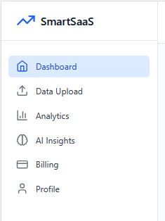

# 📊 BusinessLens — Smart SaaS Analytics Dashboard

**BusinessLens** is a modern AI-powered SaaS platform that helps users monitor business data, gain actionable insights, manage billing, and personalize their dashboard — all in one seamless experience.

> Built using the **MERN stack**, with integrations like **OpenAI** for insights and **Stripe** for billing.

---

## 🚀 Features

- 🔐 Secure Login/Signup with JWT
- 📊 Dynamic Analytics & Dashboard
- 🤖 AI Insights using OpenAI
- 📤 Upload Business Data
- 💳 Stripe Billing Integration
- 🧑 User Profile & Preferences
- 🌗 Dark/Light Theme Toggle
- 📬 Email Notifications with Nodemailer

---

## 🛠 Tech Stack

### 🔧 Backend
- Node.js + Express.js
- MongoDB + Mongoose
- JWT Authentication
- OpenAI API
- Stripe API
- Nodemailer (SMTP)
- Multer (File Uploads)

### 🎨 Frontend
- React 18 + Vite
- Tailwind CSS
- React Hook Form
- React Router DOM
- Recharts
- Lucide Icons
- React Hot Toast

---

## ⚙️ Environment Variables

Create a `.env` file in the `/server` directory:

```env
PORT=5000
MONGODB_URI=mongodb://127.0.0.1:27017/businesslens
JWT_SECRET=your_jwt_secret
OPENAI_API_KEY=your_openai_api_key
STRIPE_SECRET_KEY=your_stripe_secret_key
STRIPE_WEBHOOK_SECRET=your_stripe_webhook_secret
EMAIL_USER=your_email@gmail.com
EMAIL_PASS=your_email_password
FRONTEND_URL=http://localhost:5173
NODE_ENV=development
```

---

## 📡 Sample API Endpoints

| Method | Route                   | Description                    |
|--------|-------------------------|--------------------------------|
| POST   | `/api/auth/register`    | Register new user              |
| POST   | `/api/auth/login`       | Login existing user            |
| GET    | `/api/analytics`        | Fetch analytics data           |
| POST   | `/api/data/upload`      | Upload CSV or business file    |
| POST   | `/api/ai/insights`      | Generate AI-based suggestions  |
| PATCH  | `/api/user/profile`     | Update user profile            |
| DELETE | `/api/user/delete`      | Delete user account            |

---

## 💻 Installation & Running Locally

### 1. Clone the Repository
```bash
git clone https://github.com/your-username/businesslens.git
cd businesslens
```

### 2. Install Dependencies

```bash
# Install root dependencies
npm install

# Install backend dependencies
cd server
npm install
```

### 3. Run the App

```bash
# Go back to root and start both frontend & backend
npm run dev
```

> This uses `concurrently` to run:
- Frontend on [http://localhost:5173](http://localhost:5173)
- Backend on [http://localhost:5000](http://localhost:5000)

---

## 🧠 AI Integration

Using **OpenAI API**, BusinessLens analyzes uploaded business data to generate:

- Smart trends
- Actionable suggestions
- AI-powered growth metrics

---

## 💳 Stripe Billing

Seamless integration with **Stripe** allows:

- Secure payments
- Subscription tracking
- Real-time webhook updates

---

## 🔐 Authentication & Security

- JWT-based session management
- Protected frontend routes with React Context
- Backend middleware for route protection

---

## 📷 Screenshots

      
 
---

## 📫 Contact

- **Author:** Himani Arora  
- **Email:** arorahimani080@gmail.com

---

## 🛡 License

MIT © 2025 Himani Arora  
✨ *BusinessLens — Empowering business decisions with data and intelligence.*
